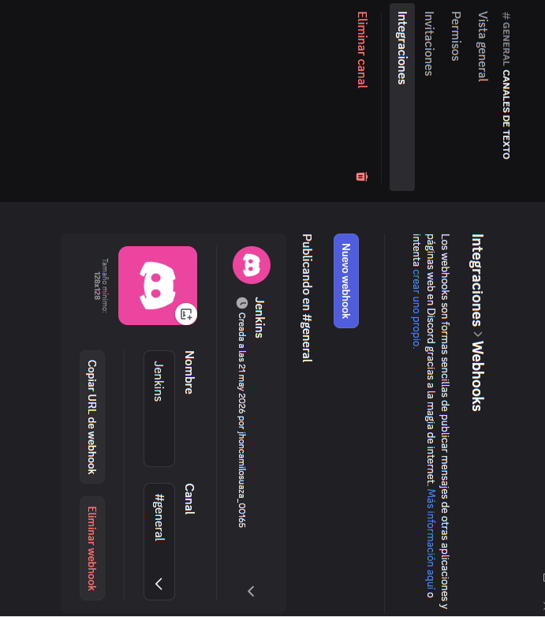
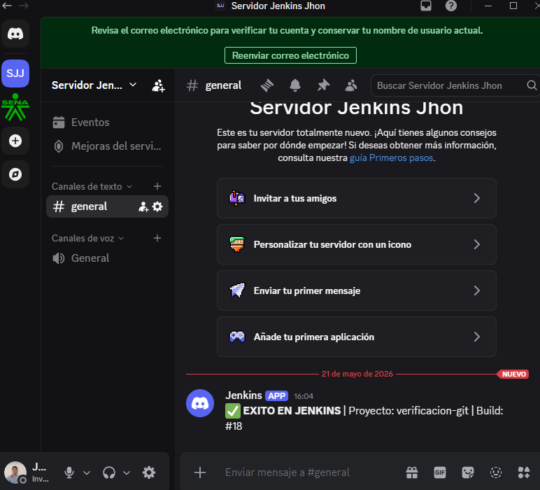
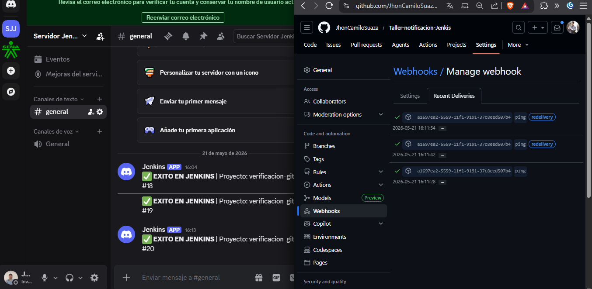
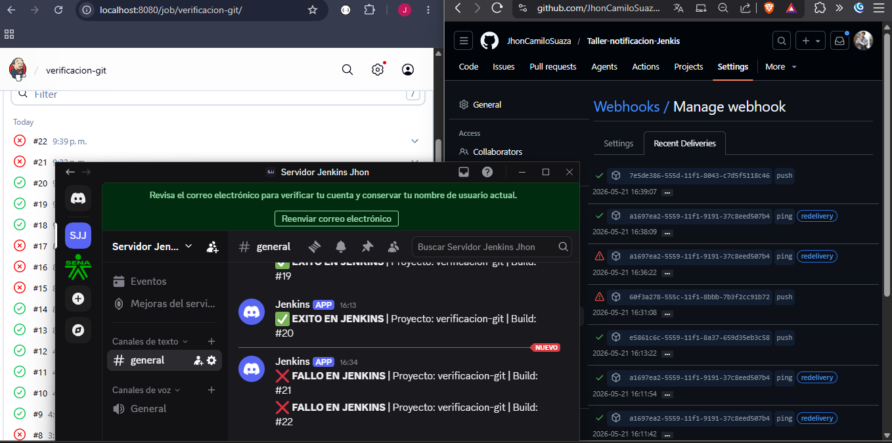
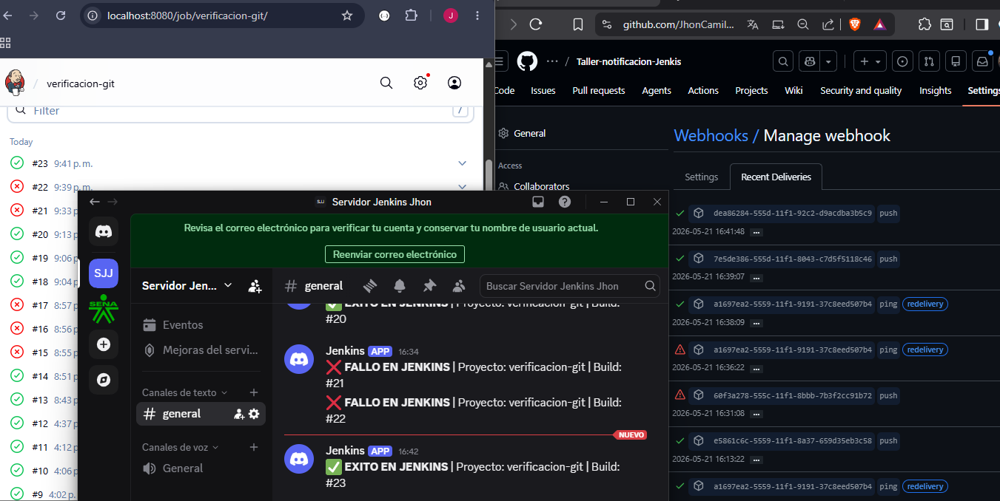

# 🎮 Integración de Jenkins con Discord (Notificaciones CI/CD)

Este documento detalla el proceso paso a paso para configurar Jenkins de manera que envíe notificaciones automáticas (alertas de éxito o fallo) a un canal de Discord mediante el uso de Webhooks.

---

## 🛠️ Paso 1: Generación del Webhook en Discord

Para establecer la comunicación entre Jenkins y Discord, es necesario crear un Webhook que servirá como canal de entrada para los mensajes.

1. **Selección del canal:** Se seleccionó el canal de texto destinado para las alertas de Integración Continua dentro del servidor de Discord.
2. **Creación de la integración:** A través de los ajustes del canal (`Editar Canal` -> `Integraciones` -> `Webhooks`), se generó un nuevo Webhook llamado **Jenkins**.

*(La evidencia de la creación del Webhook se muestra a continuación).*



---

## 🚀 Paso 2: Integración en Jenkinsfile

Se modificó el archivo `Jenkinsfile` del proyecto para incluir la instrucción `sh` con el comando `curl`. Esto permite a Jenkins enviar notificaciones JSON al Webhook de Discord dependiendo de si el pipeline falla o tiene éxito.

**Bloque de código agregado (éxito):**

```groovy
sh """
    curl -H "Content-Type: application/json" \
    -d '{"content": "✅ **EXITO EN JENKINS** | Proyecto: ${env.JOB_NAME} | Build: #${env.BUILD_NUMBER}"}' \
    <URL_DEL_WEBHOOK_DISCORD>
"""
```

**Bloque de código agregado (fallo):**

```groovy
sh """
    curl -H "Content-Type: application/json" \
    -d '{"content": "❌ **FALLO EN JENKINS** | Proyecto: ${env.JOB_NAME} | Build: #${env.BUILD_NUMBER}"}' \
    <URL_DEL_WEBHOOK_DISCORD>
"""
```

---

## 📸 Paso 3: Iteración 1 – Primera prueba de éxito (SUCCESS ✅)

Se realizó el primer `git push` con la configuración de Discord integrada al `Jenkinsfile`. Jenkins ejecutó el pipeline correctamente y envió la notificación de éxito al canal de Discord.



---

## 📸 Paso 4: Iteración 2 – Ejecución automática vía Webhook (SUCCESS ✅)

Se verificó que el pipeline se dispara **automáticamente** (sin pulsar "Construir ahora") al realizar un `git push`. El Webhook de GitHub notifica a Jenkins a través de un túnel SSH (`localhost.run`), y Jenkins ejecuta el pipeline sin intervención manual.



---

## 📸 Paso 5: Iteración 3 – Error intencional (FAILURE ❌)

Se introdujo un fallo intencional en el archivo de pruebas `PracticaJenkinsApplicationTests.java` mediante la instrucción `Assertions.fail()`. Al hacer `git push`, Jenkins detectó el cambio automáticamente, ejecutó el pipeline, **falló en la etapa de tests** y envió la notificación de error al canal de Discord.

**Código del error intencional:**

```java
@Test
void contextLoads() {
    // ERROR INTENCIONAL para probar notificación Discord (FAILURE)
    Assertions.fail("Error intencional - Prueba Discord FAIL");
}
```



---

## 📸 Paso 6: Iteración 4 – Corrección del error (SUCCESS ✅)

Se eliminó el `Assertions.fail()` del archivo de pruebas, restaurando el test a su estado funcional original. Al hacer `git push`, Jenkins se disparó automáticamente, el pipeline pasó exitosamente y Discord recibió la notificación de éxito.

**Código corregido:**

```java
@Test
void contextLoads() {
    // Test restaurado - sin errores
}
```



---

## ✅ Conclusiones

| Iteración | Acción realizada | Resultado del Pipeline | Notificación Discord |
|-----------|-----------------|----------------------|---------------------|
| 1 | Configuración inicial del Webhook | SUCCESS ✅ | Mensaje de éxito |
| 2 | Push automático vía Webhook | SUCCESS ✅ | Mensaje de éxito |
| 3 | Error intencional (`Assertions.fail`) | FAILURE ❌ | Mensaje de fallo |
| 4 | Corrección del error | SUCCESS ✅ | Mensaje de éxito |

- **Webhook funcional:** La comunicación entre GitHub → Jenkins → Discord opera correctamente mediante túneles SSH.
- **Automatización completa:** Los builds se disparan automáticamente al detectar cambios en el repositorio, sin intervención manual.
- **Notificaciones bidireccionales:** Se validó tanto el flujo de éxito (✅) como el de fallo (❌), demostrando la capacidad del sistema para alertar en ambos escenarios.
