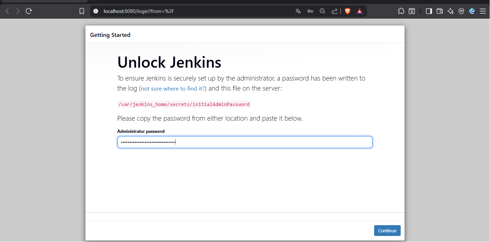
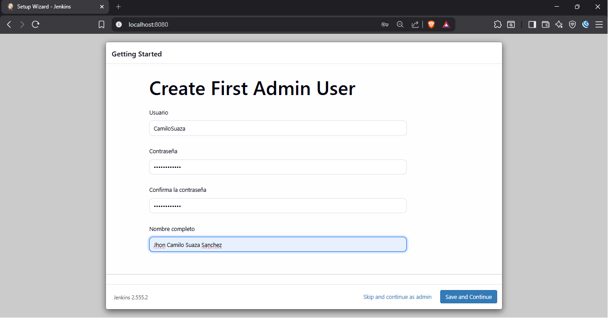
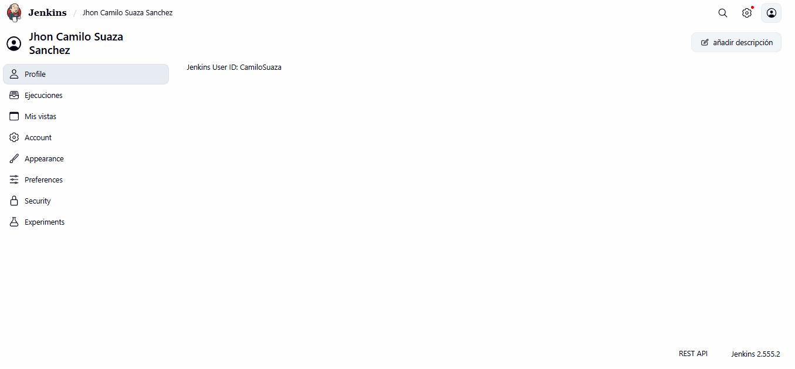
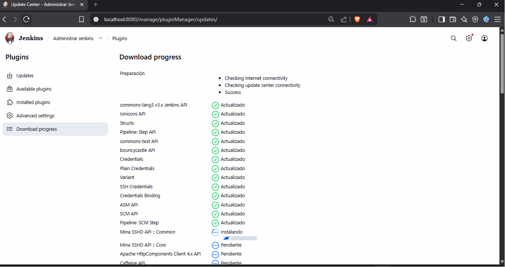
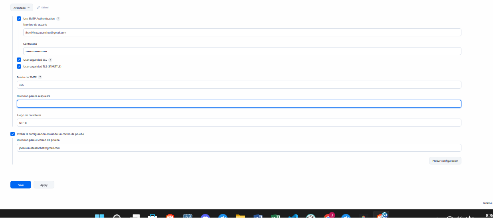
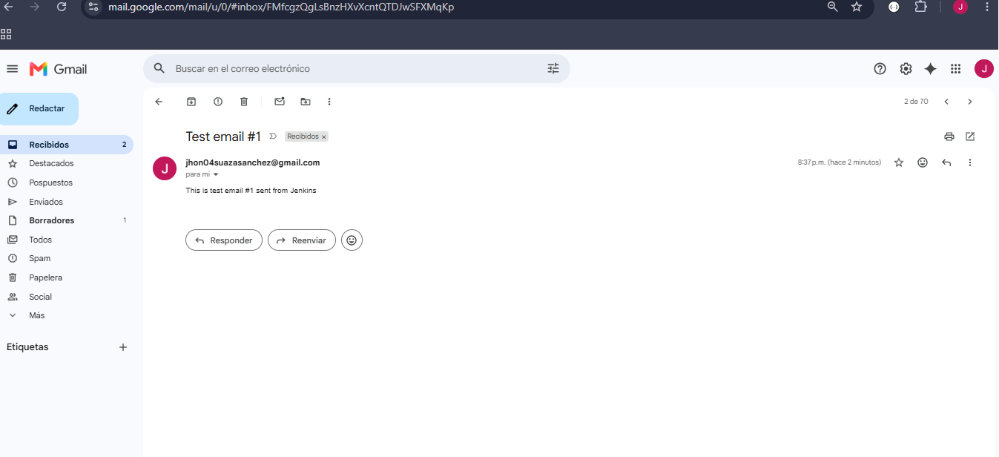
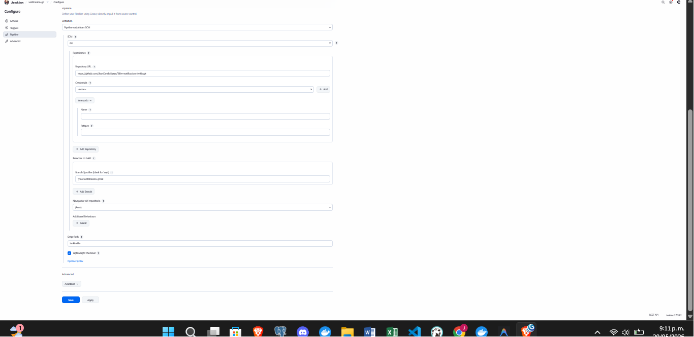
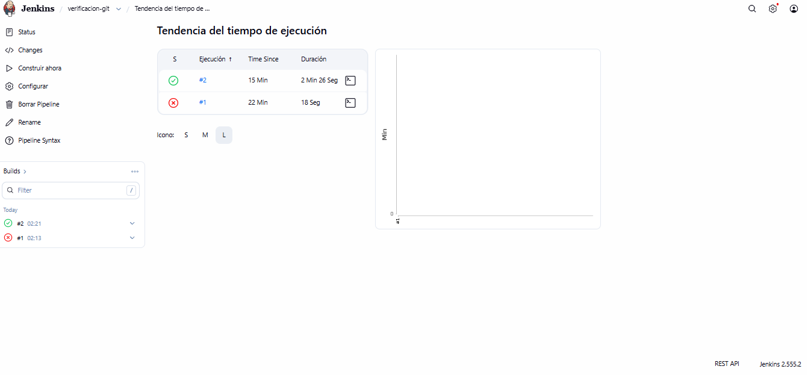
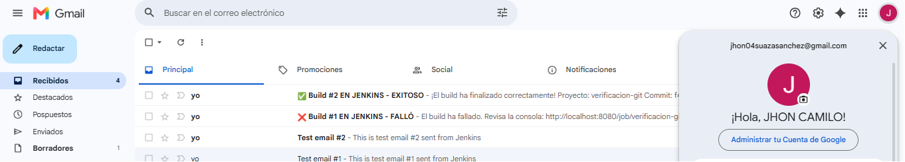

# Instalación y Configuración de Jenkins con Notificaciones

> **Objetivo:** Documentar paso a paso la instalación, desbloqueo, configuración inicial de Jenkins y la integración de notificaciones por correo (Gmail).
> **Ámbito:** Esta documentación se realiza en la rama `dev` y se integra de manera definitiva al finalizar el taller.

---

## 0️⃣ Paso 0 – Instalación y Configuración Inicial de Jenkins {#cap-config-inicial}

### Paso 0.1: Desbloquear Jenkins (Unlock Jenkins)
1. Abre tu navegador de internet e ingresa a: <http://localhost:8080>.
2. Ingresa la contraseña de administrador obtenida desde tu terminal con el comando:
   `docker exec jenkins cat /var/jenkins_home/secrets/initialAdminPassword`

---
📸 **FOTO 1 A TOMAR:** Captura de pantalla de la ventana **Unlock Jenkins** con la contraseña ingresada antes de dar clic en Continue.
Guarda la imagen como `foto1_unlock_jenkins.png` en la carpeta `imagenes` y colócala aquí:


---

### Paso 0.2: Crear el Primer Usuario Administrador
1. Tras omitir la instalación inicial de plugins (para evitar errores de red), completa el formulario de creación de usuario administrador:
   * **Username:** `camilosuaza`
   * **Password:** (la contraseña elegida)
   * **Full Name:** `Jhon Camilo Suaza Sanchez`
   * **E-mail Address:** (tu correo electrónico)
2. Guarda los datos e ingresa la URL de instancia por defecto: `http://localhost:8080/`.

---
📸 **FOTO 2 A TOMAR:** Captura de pantalla del formulario **Create First Admin User** con tus datos rellenos antes de hacer clic en Save and Continue.
Guarda la imagen como `foto2_crear_usuario.png` en la carpeta `imagenes` y colócala aquí:


---

### Paso 0.3: Panel de Control Principal de Jenkins (Dashboard)
1. Haz clic en **Save and Finish** y luego en **Start using Jenkins**.
2. Llegarás a la pantalla de bienvenida y el panel de control principal de Jenkins.

---
📸 **FOTO 3 A TOMAR:** Captura de pantalla completa del panel de control principal (**Dashboard**) de Jenkins recién iniciado.
Guarda la imagen como `foto3_dashboard_jenkins.png` en la carpeta `imagenes` y colócala aquí:


---

### Paso 0.4: Descarga e Instalación de Plugins Requeridos
1. Ve a **Administrar Jenkins** → **Plugins** → **Available plugins**.
2. Busca e instala los siguientes plugins: **Git**, **GitHub**, **Pipeline**, **Maven Integration** y **Mailer**.

---
📸 **FOTO 4 A TOMAR:** Captura de pantalla del progreso de instalación de plugins (**Download progress**), mostrando la lista de plugins instalándose.
Guarda la imagen como `foto4_descarga_plugins.png` en la carpeta `imagenes` y colócala aquí:


---

---

## 1️⃣ Paso 1 – Configurar el servidor SMTP de Gmail en Jenkins {#cap-smtp-gmail}

1. Ve a **Manage Jenkins → Configure System**.
2. Busca la sección **E‑mail Notification** y completa los campos con los siguientes datos:

| Campo | Valor |
|---|---|
| **SMTP server** | `smtp.gmail.com` |
| **Use SSL** | ✅ |
| **Port** | `465` |
| **Authentication** | Marca la casilla y escribe tu **usuario Gmail** y **contraseña de aplicación** (no la normal). |
| **Reply‑to address** | (opcional) tu mismo Gmail. |

> **Crear contraseña de aplicación:**
> 1. Entra a las opciones de seguridad de tu cuenta Google: <https://myaccount.google.com/security>.
> 2. Activa la **Verificación en 2 pasos** si no la tienes activa.
> 3. En **Contraseñas de aplicación (App passwords)**, genera una nueva contraseña llamada *Jenkins* y copia la clave de 16 caracteres.

3. Pulsa **Test configuration**, introduce tu correo para probar que el envío funciona y haz clic en **Save**.

---
📸 **FOTO 5 A TOMAR:** Captura de pantalla a toda la sección de **E-mail Notification** configurada con tus datos antes de darle a Save.
Guarda la imagen como `foto5_smtp_config.png` en la carpeta `imagenes` y colócala aquí abajo:


---

---
📸 **FOTO 6 A TOMAR:** Toma una captura de pantalla del correo electrónico de prueba que te acaba de llegar a tu bandeja de entrada de Gmail (remitente "nobody@nowhere" o tu mismo correo, asunto "Test email #1").
Guarda la imagen como `foto6_correo_prueba.png` en la carpeta `imagenes` y colócala aquí abajo:


---

---

## 2️⃣ Paso 2 – Añadir el bloque `mail` al `Jenkinsfile` {#cap-jenkinsfile-mail}

Edita el archivo `Jenkinsfile` en tu proyecto y reemplaza su contenido con:

```groovy
pipeline {
    agent any

    stages {
        stage('Build and Test') {
            steps {
                // Usa el wrapper Maven incluido en el proyecto
                sh './mvnw clean verify'
            }
        }
    }

    // ---------- NOTIFICACIONES ----------
    post {
        always {
            junit testResults: 'target/surefire-reports/*.xml',
                  allowEmptyResults: true
        }

        // ---- NOTIFICACIÓN POR GMAIL (ÉXITO) ----
        success {
            mail to: 'jhon04suazasanchez@gmail.com',
                 subject: "✅ Build #${env.BUILD_NUMBER} EN JENKINS - EXITOSO",
                 body: """\
                     ¡El build ha finalizado correctamente!
                     Proyecto: ${env.JOB_NAME}
                     Commit: ${env.GIT_COMMIT}
                     URL: ${env.BUILD_URL}
                 """
        }

        // ---- NOTIFICACIÓN POR GMAIL (FALLA) ----
        failure {
            mail to: 'jhon04suazasanchez@gmail.com',
                 subject: "❌ Build #${env.BUILD_NUMBER} EN JENKINS - FALLÓ",
                 body: """\
                     El build ha fallado.
                     Revisa la consola: ${env.BUILD_URL}console
                     Proyecto: ${env.JOB_NAME}
                     Commit: ${env.GIT_COMMIT}
                 """
        }
    }
}
```

- **Reemplaza** `jhon04suazasanchez@gmail.com` por tu dirección de correo de Gmail.
- Guarda el archivo.

---

## 3️⃣ Paso 3 – Guardar cambios en Git (rama dev) {#cap-commit-push}

```bash
git add Jenkinsfile MD/Notificacion-Gmail-Jenkins.md
git commit -m "Actualizar Jenkinsfile y documentación inicial"
git push origin dev
```

---

## 4️⃣ Paso 4 – Probar el Pipeline y Recibir el Correo {#cap-probar}

1. En tu panel de Jenkins, ve a **New Item** (Nueva Tarea) → Nombre: `verificacion-git` → Selecciona **Pipeline** → **OK**.
2. En la configuración del Pipeline, ve a la sección **Pipeline** de abajo y haz lo siguiente:
   * En **Definition**, selecciona **Pipeline script from SCM** (Script de Pipeline desde SCM).
   * En **SCM**, selecciona **Git**.
   * En **Repository URL**, pega la URL de tu repositorio de GitHub: `https://github.com/JhonCamiloSuaza/Taller-notificacion-Jenkis.git`
   * En **Branch Specifier (blank for 'any')**, cambia `*/master` o `*/main` por: **`*/feat-notificacion-gmail`** (muy importante, ya que estamos trabajando en nuestra rama hija).
   * En **Script Path**, asegúrate de que diga **`Jenkinsfile`**.

---
📸 **FOTO 7 A TOMAR:** Captura de pantalla de la configuración del Pipeline en Jenkins, donde se observe la URL de GitHub y la rama `*/feat-notificacion-gmail`.
Guarda la imagen como `foto7_pipeline_config.png` en la carpeta `imagenes` y colócala aquí abajo:


---

3. Haz clic en **Save** (Guardar).
4. Haz clic en **Build Now** (Construir ahora) para ejecutar el pipeline.
5. Cuando finalice (se pondrá en verde), entra al número de build (ej. `#2`) y abre **Console Output** (Salida de consola).

---
📸 **FOTO 8 A TOMAR:** Captura de pantalla de la salida de consola (Console Output) en Jenkins, donde se observe que el build finalizó con éxito y se envió el correo (`Finished: SUCCESS`).
Guarda la imagen como `foto8_console_output.png` en la carpeta `imagenes` y colócala aquí abajo:


---

6. Revisa tu bandeja de correo Gmail.

---
📸 **FOTO 9 A TOMAR:** Captura de pantalla de tu bandeja de entrada de Gmail (o del correo recibido abierto) mostrando la notificación de éxito enviada por Jenkins para el build real.
Guarda la imagen como `foto9_correo_recibido.png` en la carpeta `imagenes` y colócala aquí abajo:


---
