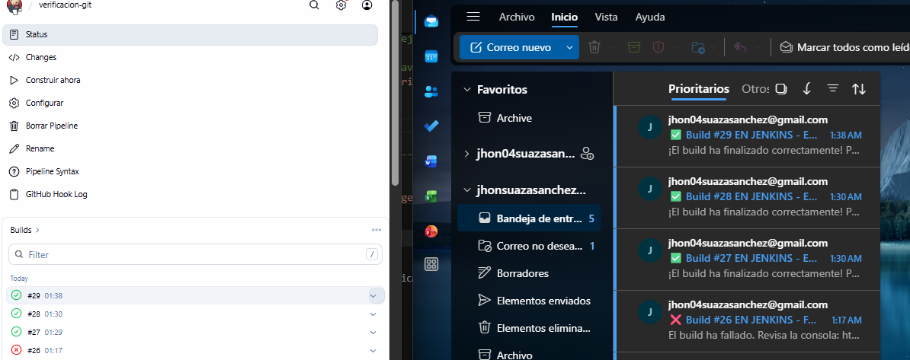
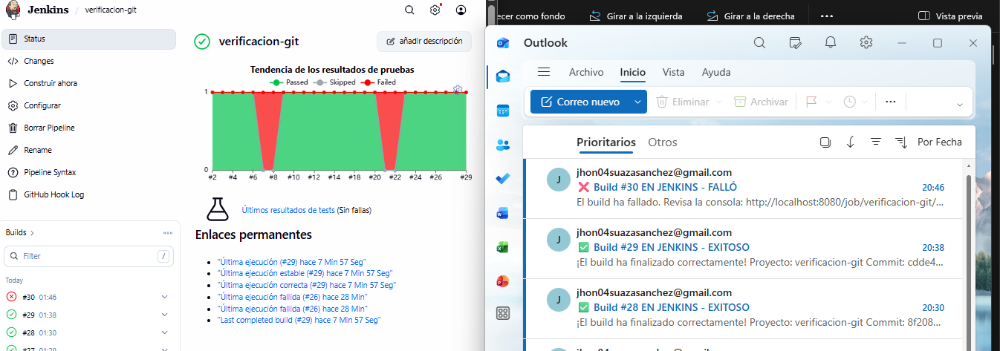
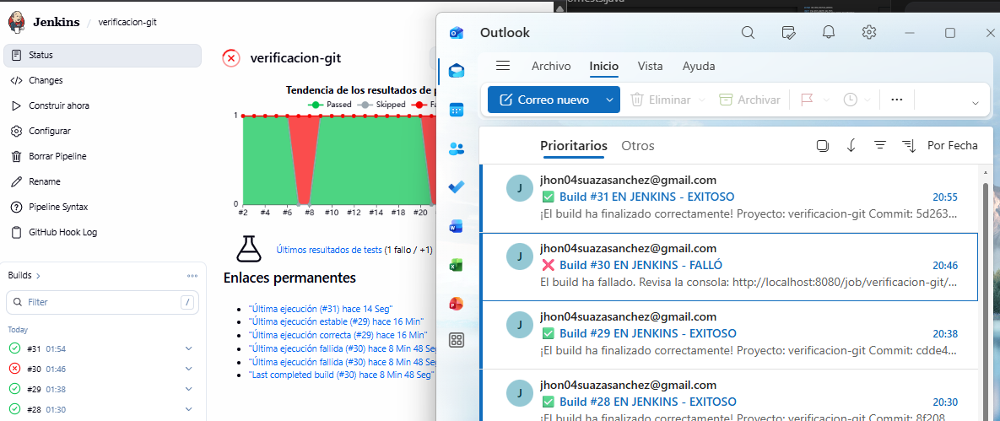

# 📧 Integración de Jenkins con Outlook (Notificaciones CI/CD)

Este documento detalla el proceso paso a paso para configurar Jenkins de manera que envíe notificaciones automáticas (alertas de éxito o fallo) a la cuenta de correo de **Outlook** (`jhonsuazasanchez@outlook.com`) mediante el pipeline declarativo de Jenkins.

---

## 🛠️ Paso 1: Configuración en Jenkinsfile

Se modificó el archivo `Jenkinsfile` del proyecto para incluir el comando `mail`, apuntando a la dirección de correo de Outlook (`jhonsuazasanchez@outlook.com`). Jenkins utilizará su servidor SMTP (configurado previamente con Gmail) para hacer la entrega en la bandeja de entrada de Outlook.

**Bloque de código agregado (éxito):**

```groovy
// ---- NOTIFICACIÓN POR GMAIL Y OUTLOOK (ÉXITO) ----
success {
    mail to: 'jhon04suazasanchez@gmail.com, jhonsuazasanchez@outlook.com',
         subject: "✅ Build #${env.BUILD_NUMBER} EN JENKINS - EXITOSO",
         body: """\\
             ¡El build ha finalizado correctamente!
             Proyecto: ${env.JOB_NAME}
             Commit: ${env.GIT_COMMIT}
             URL: ${env.BUILD_URL}
         """
}
```

**Bloque de código agregado (fallo):**

```groovy
// ---- NOTIFICACIÓN POR GMAIL Y OUTLOOK (FALLA) ----
failure {
    mail to: 'jhon04suazasanchez@gmail.com, jhonsuazasanchez@outlook.com',
         subject: "❌ Build #${env.BUILD_NUMBER} EN JENKINS - FALLÓ",
         body: """\\
             El build ha fallado.
             Revisa la consola: ${env.BUILD_URL}console
             Proyecto: ${env.JOB_NAME}
             Commit: ${env.GIT_COMMIT}
         """
}
```

---

## 📸 Paso 2: Iteración 1 – Primera ejecución del pipeline (FAILURE ❌)

**Rama:** `feat-notificacion-outlook`

Se realizó el primer `git push` con la configuración de correo integrada al `Jenkinsfile`. Jenkins detectó el push automáticamente a través del Webhook de GitHub y ejecutó el pipeline. Debido a un error de configuración en el comando de Maven (`mvnw` sin el prefijo `./`), la etapa de compilación falló. Esto activó el bloque `failure` del pipeline, enviando la notificación de error a Outlook.


---

## 📸 Paso 3: Iteración 2 – Corrección del error de compilación (SUCCESS ✅)

**Rama:** `feat-notificacion-outlook`

Se reparó el `Jenkinsfile` ajustando el comando a `./mvnw` para otorgar compatibilidad con el entorno de ejecución Linux del contenedor Jenkins. Al realizar el nuevo `push`, Jenkins ejecutó el pipeline correctamente y Outlook recibió el correo de éxito confirmando la reparación.


---

## 📸 Paso 4: Iteración 3 – Cambio funcional en nueva rama (SUCCESS ✅)

**Rama:** `feature/login-ui-outlook`

Se creó una nueva rama de desarrollo para simular un cambio funcional. Se agregó un nuevo endpoint (`/login-outlook`) al controlador `HelloWorldController.java`. Al hacer `push`, Jenkins se disparó automáticamente, el pipeline pasó todas sus etapas en verde y Outlook recibió la notificación de éxito.

**Código del cambio funcional:**

```java
@GetMapping("login-outlook")
public String loginOutlook() {
    return "Acceso concedido - Simulación de login exitoso para Outlook";
}
```



---

## 📸 Paso 5: Iteración 4 – Error intencional en tests (FAILURE ❌)

**Rama:** `feature/auth-error-outlook`

Se introdujo un fallo intencional en el archivo de pruebas `PracticaJenkinsApplicationTests.java` mediante la instrucción `Assertions.fail()`. Al hacer `push`, Jenkins detectó el cambio automáticamente, ejecutó el pipeline, **falló en la etapa de tests** y envió la notificación de error a Outlook.

**Código del error intencional:**

```java
@Test
void contextLoads() {
    // ERROR INTENCIONAL para probar la rama feature/auth-error-outlook
    org.junit.jupiter.api.Assertions.fail("Fallo simulado para validación de Outlook");
}
```



---

## 📸 Paso 6: Iteración 5 – Corrección del error intencional (SUCCESS ✅)

**Rama:** `feature/auth-error-outlook`

Se eliminó el `Assertions.fail()` del archivo de pruebas, restaurando el test a su estado funcional original. Al hacer `push`, Jenkins se disparó automáticamente, el pipeline pasó exitosamente y Outlook recibió la notificación de éxito.

**Código corregido:**

```java
@Test
void contextLoads() {
    // Test restaurado - error corregido exitosamente
}
```



---

## ✅ Conclusiones

| Iteración | Rama | Acción realizada | Resultado | Notificación Outlook |
|-----------|------|-----------------|-----------|---------------------|
| 1 | `feat-notificacion-outlook` | Configuración inicial | FAILURE ❌ | Correo de fallo |
| 2 | `feat-notificacion-outlook` | Corrección de `./mvnw` | SUCCESS ✅ | Correo de éxito |
| 3 | `feature/login-ui-outlook` | Nuevo endpoint `/login-outlook` | SUCCESS ✅ | Correo de éxito |
| 4 | `feature/auth-error-outlook` | Error intencional (`Assertions.fail`) | FAILURE ❌ | Correo de fallo |
| 5 | `feature/auth-error-outlook` | Corrección del error | SUCCESS ✅ | Correo de éxito |

- **Notificaciones por Correo:** La integración con Outlook se logró utilizando la función nativa `mail` del pipeline declarativo de Jenkins, reutilizando la configuración SMTP ya existente (Gmail).
- **Automatización completa:** El webhook de GitHub y el túnel SSH (`localhost.run`) permitieron la ejecución automática del pipeline tras cada `push`, notificando el resultado en tiempo real a la bandeja de entrada de Outlook.
- **Feedback visual:** El uso de emojis (✅ y ❌) en el Asunto del correo facilita la rápida identificación del estado del pipeline sin necesidad de abrir el mensaje.
- **Simetría con otras integraciones:** Se mantuvo la misma estructura de ramas y flujo de iteraciones utilizada en las integraciones de Gmail y Discord, demostrando consistencia en el proceso CI/CD.
