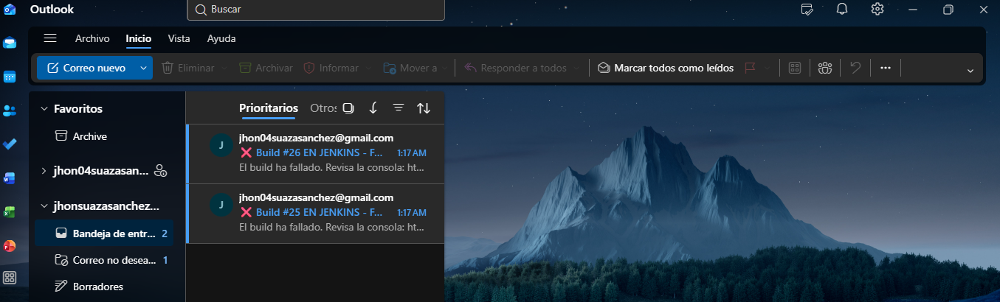
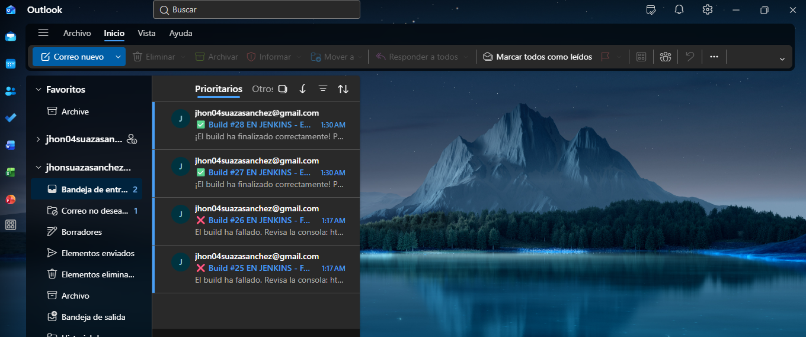

# 📧 Integración de Jenkins con Outlook (Notificaciones CI/CD)

Este documento detalla el proceso paso a paso para configurar Jenkins de manera que envíe notificaciones automáticas (alertas de éxito o fallo) a la cuenta de correo de Outlook.

---

## 🛠️ Paso 1: Configuración en Jenkinsfile

Se modificó el archivo `Jenkinsfile` del proyecto para incluir el comando `mail`, apuntando a la dirección de correo de Outlook (`jhonsuazasanchez@outlook.com`). Jenkins utilizará su servidor de correo configurado para hacer la entrega en la bandeja de entrada de Outlook.

**Bloque de código agregado (éxito):**

```groovy
mail to: 'jhonsuazasanchez@outlook.com',
     subject: "✅ Build #${env.BUILD_NUMBER} EN JENKINS - EXITOSO",
     body: """\\
         ¡El build ha finalizado correctamente!
         Proyecto: ${env.JOB_NAME}
         Commit: ${env.GIT_COMMIT}
         URL: ${env.BUILD_URL}
     """
```

**Bloque de código agregado (fallo):**

```groovy
mail to: 'jhonsuazasanchez@outlook.com',
     subject: "❌ Build #${env.BUILD_NUMBER} EN JENKINS - FALLÓ",
     body: """\\
         El build ha fallado en la etapa de tests.
         Revisa la consola: ${env.BUILD_URL}console
         Proyecto: ${env.JOB_NAME}
         Commit: ${env.GIT_COMMIT}
     """
```

---

## 📸 Paso 2: Iteración 1 – Ejecución automática y Error en pruebas (FAILURE ❌)

Jenkins detectó el `push` automáticamente a través del Webhook de GitHub y ejecutó el pipeline. Debido a un error de configuración en el comando de Maven en el entorno Linux, la etapa de compilación y pruebas falló. Esto activó el bloque `failure` del pipeline, enviando de manera automática la notificación de error a Outlook.



---

## 📸 Paso 3: Iteración 2 – Corrección del error (SUCCESS ✅)

Se reparó el `Jenkinsfile` ajustando el comando a `./mvnw` para otorgar compatibilidad con el entorno de ejecución Linux. Al realizar el nuevo `push`, Jenkins se disparó automáticamente, el pipeline pasó todas sus etapas en verde y Outlook recibió el correo de éxito confirmando la reparación del proyecto.



---

## ✅ Conclusiones

- **Notificaciones por Correo:** La integración con Outlook se logró utilizando la función nativa `mail` del pipeline declarativo de Jenkins.
- **Automatización total:** El webhook de GitHub y el túnel SSH (`localhost.run`) permitieron la ejecución automática del pipeline tras cada `push`, notificando el resultado en tiempo real a la bandeja de entrada del SENA.
- **Feedback visual:** El uso de emojis (✅ y ❌) en el Asunto del correo facilita la rápida identificación del estado del pipeline sin necesidad de abrir el mensaje.
