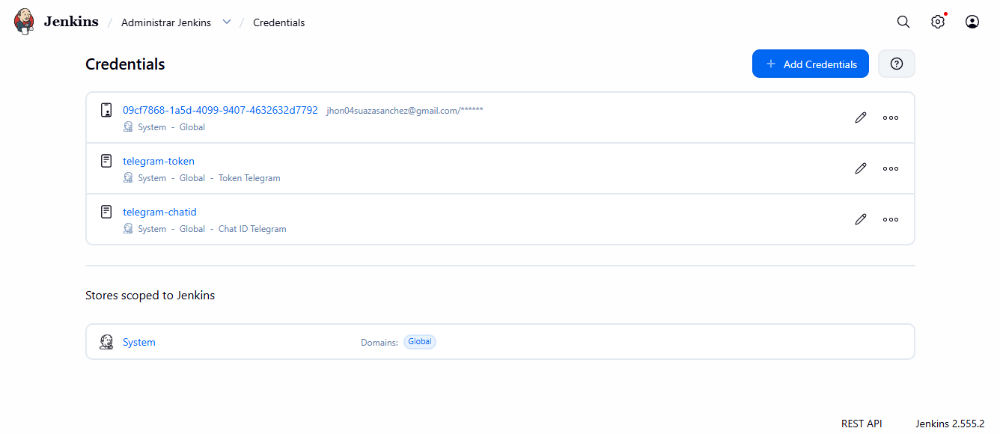
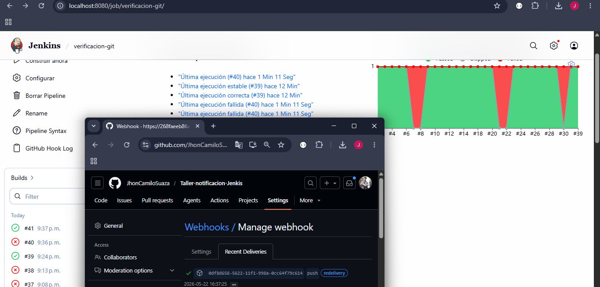
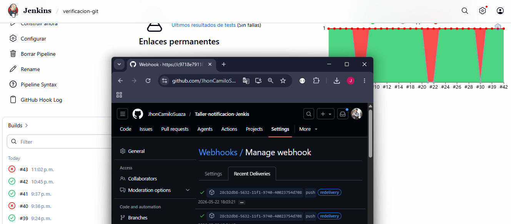
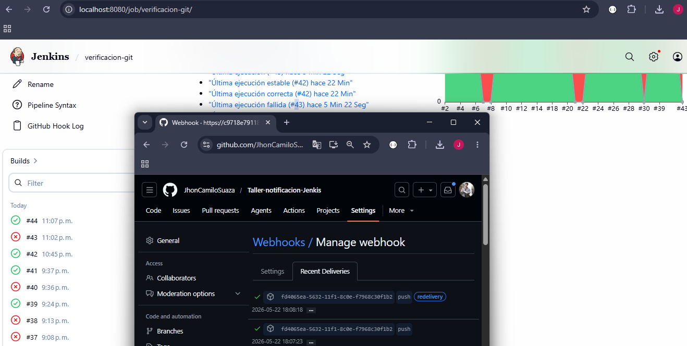

# 📱 Integración de Jenkins con Telegram (Notificaciones CI/CD)

Este documento detalla el proceso paso a paso para configurar Jenkins de manera que envíe notificaciones automáticas (alertas de éxito o fallo) a un chat de Telegram mediante el pipeline declarativo.

---

## 🛠️ Paso 1: Configuración del Bot y Credenciales

Se creó un bot en Telegram a través de `@BotFather` y se obtuvo el Chat ID a través de `@userinfobot`.


Los valores obtenidos se guardaron de forma segura en Jenkins usando el *Credentials Store* con los IDs `telegram-token` y `telegram-chatid`. El "Scope" se configuró como **Global** para que el `Jenkinsfile` pueda acceder a ellas.



---

## 🛠️ Paso 2: Configuración en Jenkinsfile

Se modificó el archivo `Jenkinsfile` del proyecto para incluir el bloque `environment` que inyecta las credenciales, y el comando `curl` apuntando a la API de Telegram.

**Bloque de entorno:**

```groovy
environment {
    TELEGRAM_TOKEN   = credentials('telegram-token')
    TELEGRAM_CHAT_ID = credentials('telegram-chatid')
}
```

**Bloque de notificación (éxito):**

```groovy
sh """curl -s -X POST https://api.telegram.org/bot${env.TELEGRAM_TOKEN}/sendMessage \\
    -d chat_id=${env.TELEGRAM_CHAT_ID} \\
    -d parse_mode=Markdown \\
    -d text="✅ *Build #${env.BUILD_NUMBER} EN JENKINS*%0A*PROYECTO:* ${env.JOB_NAME}%0A*COMMIT:* ${env.GIT_COMMIT}%0A*URL:* ${env.BUILD_URL}" """
```

---

## 📸 Paso 3: Iteración 1 – Primera ejecución exitosa (SUCCESS ✅)

Se realizó el primer `git push` a la rama `feat-notificacion-telegram`. Jenkins detectó el cambio automáticamente a través del webhook y ejecutó el pipeline. El build terminó en verde y se recibió la notificación en Telegram.



---

## 📸 Paso 4: Iteración 2 – Error intencional en nueva rama (FAILURE ❌)

Se creó la rama `feature/auth-error-telegram` a partir de `feat-notificacion-telegram`. En `PracticaJenkinsApplicationTests.java` se añadió un fallo simulado para que Maven falle y Jenkins dispare el bloque `failure` del `Jenkinsfile`.

**Rama:** `feature/auth-error-telegram`  
**Jenkins (Branch Specifier):** `*/feature/auth-error-telegram`

Tras `git push`, el pipeline terminó en rojo y llegó la notificación ❌ a Telegram.



---

## 📸 Paso 5: Iteración 3 – Corrección del error (SUCCESS ✅)

*(Continúa en la rama `feature/login-ui-telegram` — ver commit y captura FOTO 6)*


