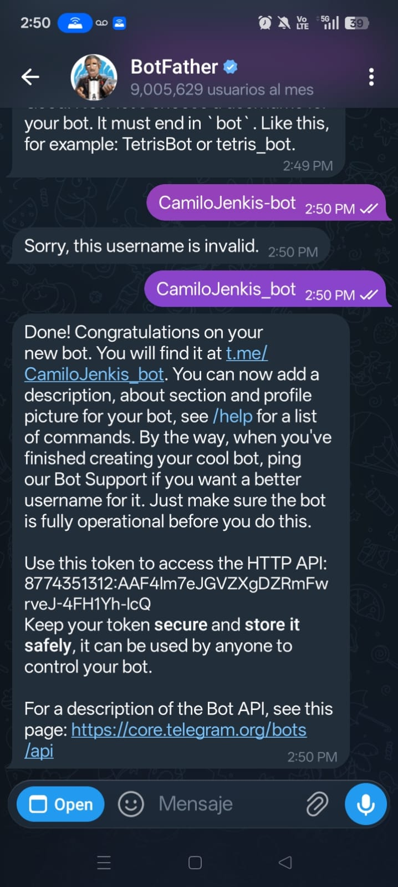
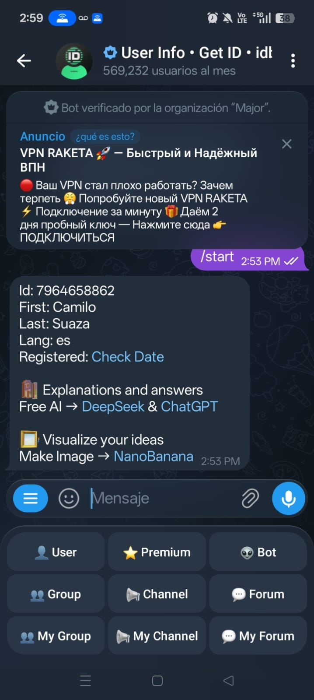

# 📱 Integración de Jenkins con Telegram (Notificaciones CI/CD)

Este documento detalla paso a paso la configuración para que Jenkins envíe notificaciones a Telegram (éxitos y fallos).

## 📂 Estructura del proyecto
```
Taller-notificacion-Jenkis/
├─ Jenkinsfile
├─ MD/
│   ├─ Gmail/
│   ├─ Discord/
│   ├─ Outlook/
│   └─ Telegram/
│        ├─ Notificacion-Telegram-Jenkins.md   <-- este archivo
│        ├─ foto1_bot_telegram.png           <-- token (solo evidencia)
│        ├─ foto2_chatid_telegram.png        <-- chat id
│        ├─ foto3_success_telegram.png       <-- mensaje de éxito
│        ├─ foto4_failure_telegram.png       <-- mensaje de error
│        └─ foto5_build_auto_telegram.png    <-- build automático
```

## 🔧 Paso a paso

| Paso | Acción | Evidencia |
|------|--------|-----------|
| 1 | Crear bot con **@BotFather** → token | `foto1_bot_telegram.png` |
| 2 | Obtener **Chat ID** (usando @userinfobot) | `foto2_chatid_telegram.png` (valor: **7964658862**) |
| 3 | Añadir credenciales a Jenkins (`telegram-token`, `telegram-chatid`) | (no se captura) |
| 4 | Modificar `Jenkinsfile` (añadir `environment` y `curl` a Telegram) | (código en este repositorio) |
| 5 | Commit & push a rama `feat-notificacion-telegram` | (log de Git) |
| 6 | Verificar mensaje **ÉXITO** en Telegram | `foto3_success_telegram.png` |
| 7 | Introducir error intencional (`Assertions.fail()`) y push → mensaje **FALLA** | `foto4_failure_telegram.png` |
| 8 | Corregir el error, push → mensaje **BUILD AUTOMÁTICO** | `foto5_build_auto_telegram.png` |

## 📸 Evidencias

- `foto1_bot_telegram.png` – token del bot.  
- `foto2_chatid_telegram.png` – chat ID (`7964658862`).  
- `foto3_success_telegram.png` – notificación de **ÉXITO**.  
- `foto4_failure_telegram.png` – notificación de **FALLA**.  
- `foto5_build_auto_telegram.png` – notificación de **BUILD AUTOMÁTICO** (push después de corregir).





## ✅ Conclusiones

- **Telegram** se integra con una simple llamada HTTP (`curl`).  
- Las credenciales se guardan en el *Credentials Store* de Jenkins → nada aparece en los logs.  
- El mismo pipeline ahora notifica a varios canales de forma efectiva.
